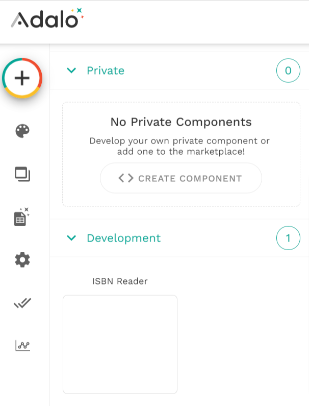
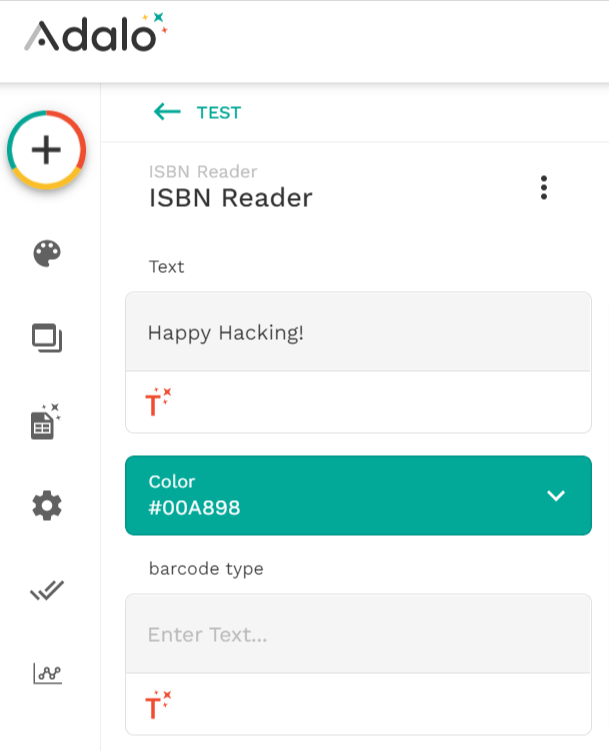
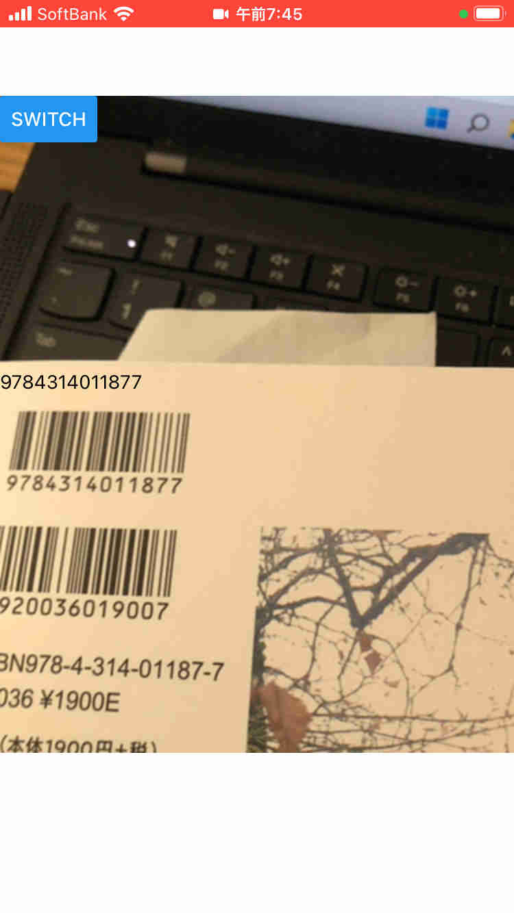

ISBN reader as Adalo component (demo)
===

## dev

```bash
# first, you need to login to adalo
npx adalo login
# add to 'development' component on Adalo 
npx adalo dev
# add to 'private' component on Adalo
npx adalo publish
```

  
  


## refs

<https://developers.adalo.com/docs/basics/introduction>
